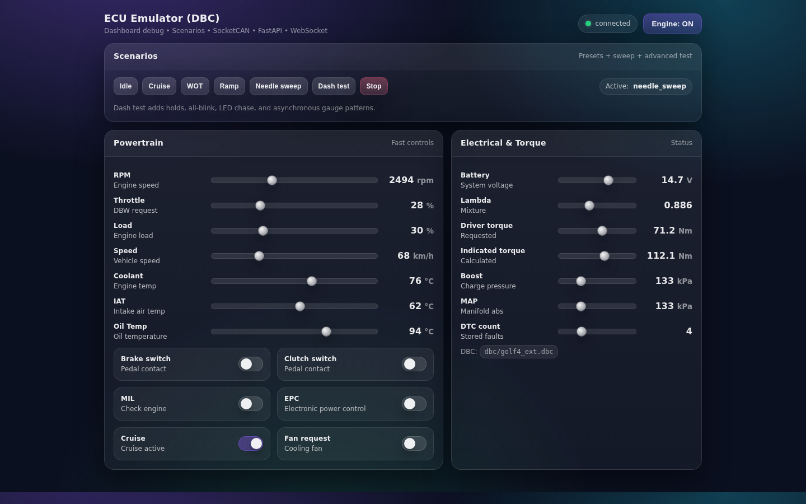
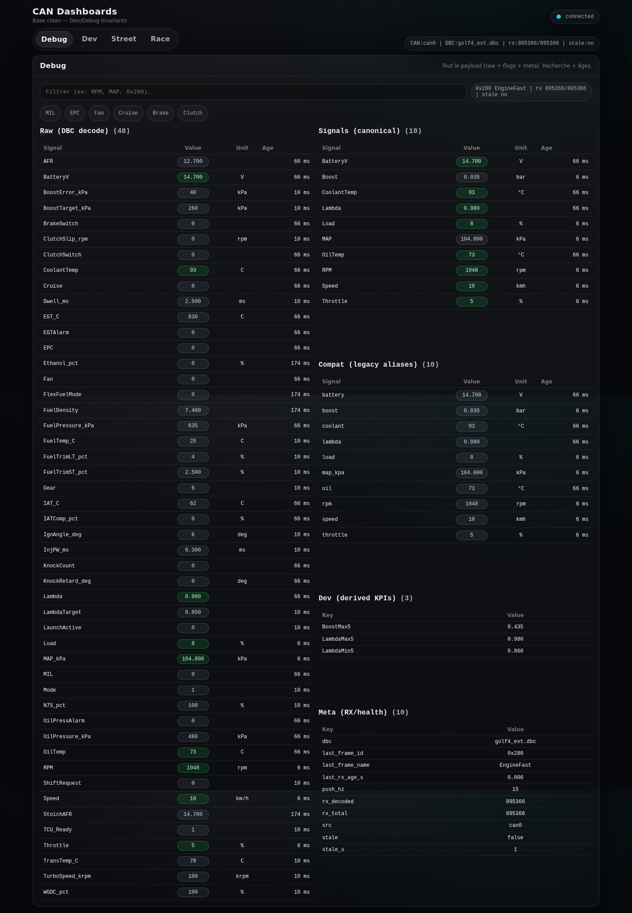
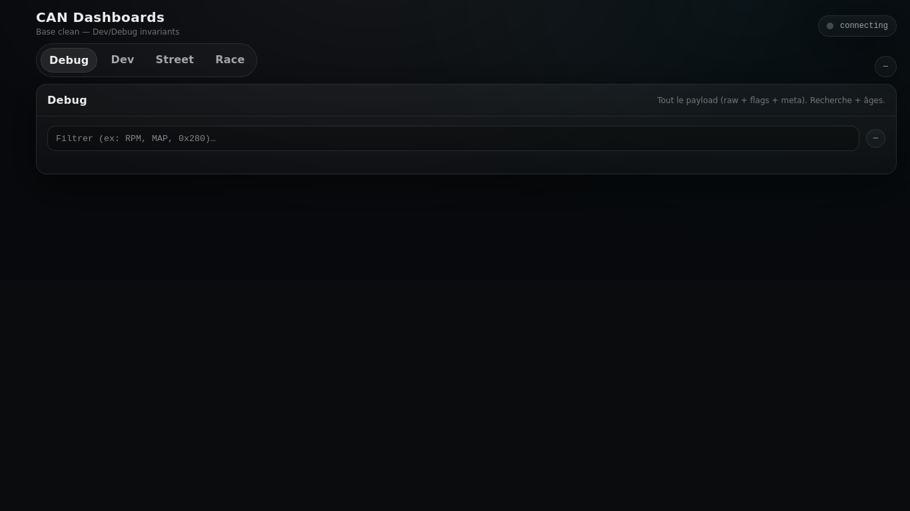
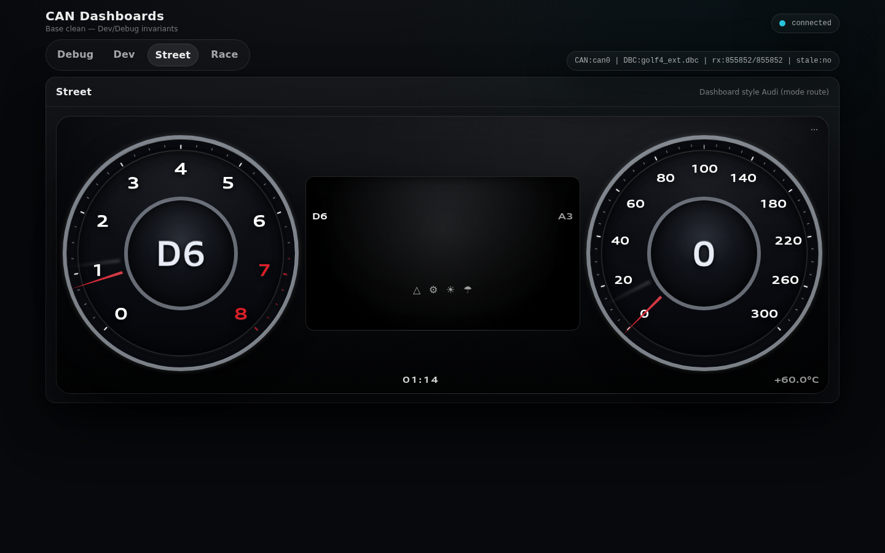

# Golf 4 CAN Bench — ECU Emulator (TX) + Liveview (RX)

This repo contains:
- **can_tx_emulator.py**: ECU emulator that **transmits** CAN frames on SocketCAN (TX), encoded via the selected DBC.
- **liveview.py**: dashboard / viewer that **reads** CAN (RX), decodes via the DBC, and exposes a web UI.
- **frames.yaml**: emitted frame configuration (periods + signal-to-state mapping).
- **dbc/golf4_min.dbc**: minimal DBC (2 messages).
- **dbc/golf4_ext.dbc**: extended DBC (8 messages).

## Prerequisites
- Linux with SocketCAN (can-utils recommended)
- Python 3.x + venv
- Access to a CAN interface `can0` (e.g. gs_usb)

Python packages:
- `python-can`, `cantools`, `fastapi`, `uvicorn[standard]`, `pyyaml`

## Quick setup

### 1) CAN interface
Configure `can0` at 500k (adjust if needed):
```bash
sudo ip link set can0 down || true
sudo ip link set can0 up type can bitrate 500000
ip -details link show can0
```

Test local RX/TX:
```bash
cansend can0 123#1122334455667788
candump -L can0 -n 3
```

### 2) Python venv
```bash
cd /opt/golf4-can-bench
python -m venv .venv
source .venv/bin/activate
pip install -U pip
pip install -r requirements.txt
```

Manual run (without systemd)
TX (emulator)
```bash
cd /opt/golf4-can-bench
source .venv/bin/activate
uvicorn can_tx_emulator:app --host 0.0.0.0 --port 8001
```

Verify that it is transmitting:
```bash
candump -L can0 -n 20
```

## RX (liveview)

Example (adjust variables if your liveview uses them):
```bash
cd /opt/golf4-can-bench
source .venv/bin/activate

CAN_CH=can0 DBC_PATH=dbc/golf4_min.dbc PUSH_HZ=15 STALE_S=1.0 \
SPEED_FACTOR=1.0 MAP_FACTOR=1.0 ATM_KPA=101.3 \
python -m uvicorn liveview:app --host 0.0.0.0 --port 8011
```

### Variables d’environnement (liveview)
- `CAN_CH` (default `can0`)
- `DBC_PATH` (default `dbc/golf4_min.dbc`)
- `PUSH_HZ` (default `15`)
- `STALE_S` (default `1.0`)
- `SPEED_FACTOR` (default `1.0`)
- `MAP_FACTOR` (default `1.0`)
- `ATM_KPA` (default `101.3`)
- `DEBUG` (voir `DEBUG.md`)

### Configuration TX (can_tx_emulator)
Le TX lit sa configuration dans `frames.yaml` (bus, DBC, messages, périodes, mapping signaux).

## UI

### TX UI (if enabled in can_tx_emulator): http://<ip>:8001

#### Snapshot (ECU Emulator)


Scenarios:
- `idle`, `cruise`, `wot`, `ramp`, `needle_sweep`, `dash_test`
- `warning_blink` (all warning lamps blinking for cluster validation)

### Liveview: http://<ip>:8011

#### Interface (Liveview)
- Top bar: WebSocket status (`connected/connecting`), visual latency via the dot (green/red).
- CAN/DBC info bar: CAN source, loaded DBC, RX counters, and `stale` indicator.
- Tabs: `Debug` (full payload), `Dev` (KPIs + derived), `Street` (dashboard Audi-style), `Race` (placeholder).
- Debug:
  - Full-text filter (e.g. `RPM`, `MAP`, `0x280`) on the payload.
  - Flags (MIL/EPC/Fan/...).
  - Signals table + ages (`age`) in seconds.
- Dev:
  - Derived KPIs (5s rolling window).
  - Synthetic flags.
- Street:
  - Audi-style dual dial cluster (left RPM, right speed).
  - Right speed scale is non-linear (0..300 km/h) with 100 km/h at vertical top.
  - Shadow needle on both dials represents rolling max (1s window), hidden when ~= current value.
  - Uses compatibility aliases (`compat.signals`) to stay robust across DBC variants.
  - Retained counter settings/spec: `docs/street-counters-spec.md`.
  - Fullscreen mode: `/webui/index.html?fullscreen=street`.
  - Quick launch button available in Liveview top bar: `Street Fullscreen`.

#### Snapshots (UI)
Debug:


Dev:


Street:



#### Snapshots (snippets)
Status line (CAN/DBC info bar):
```
CAN:can0 | DBC:golf4_min.dbc | rx:54632/22588 | stale:no
```

Snapshot payload (excerpt from /metrics):
```json
{
  "compat.signals": {
    "boost": {
      "age": 0.006264209747314453,
      "unit": "bar",
      "v": 0.05000000000000014
    },
    "map_kpa": {
      "age": 0.00626063346862793,
      "unit": "kPa",
      "v": 106.30000000000001
    },
    "rpm": {
      "age": 0.0062427520751953125,
      "unit": "rpm",
      "v": 1167.5
    },
    "speed": {
      "age": 0.006248950958251953,
      "unit": "kmh",
      "v": 122.0
    },
    "throttle": {
      "age": 0.00625300407409668,
      "unit": "%",
      "v": 9.0
    }
  },
  "dev": {
    "BoostMax5": 0.9390000000000002,
    "LambdaMax5": 0.058,
    "LambdaMin5": 0.001
  },
  "flags": {
    "Brake": 0,
    "Clutch": 0,
    "Cruise": 0,
    "EPC": 0,
    "Fan": 0,
    "MIL": 0
  },
  "meta": {
    "dbc": "golf4_min.dbc",
    "last_rx_age_s": 0.006221294403076172,
    "push_hz": 15.0,
    "rx_decoded": 22588,
    "rx_total": 54632,
    "src": "can0",
    "stale": false
  }
}
```

## systemd (recommended)

Le repo fournit des exemples dans `systemd/`:
- `systemd/can0.service`
- `systemd/can0-watchdog.service` + `systemd/can0-watchdog.timer`
- `systemd/liveview.service.example`

Installe les exemples (à adapter selon ton chemin de repo):
```bash
sudo cp systemd/can0.service /etc/systemd/system/
sudo cp systemd/can0-watchdog.service /etc/systemd/system/
sudo cp systemd/can0-watchdog.timer /etc/systemd/system/
sudo cp systemd/liveview.service.example /etc/systemd/system/liveview.service
sudo systemctl daemon-reload
```

Le repo ne contient pas de `can-tx.service` prêt à l’emploi. Crée-en un similaire à `liveview.service` avec:
- `ExecStart=uvicorn can_tx_emulator:app --host 0.0.0.0 --port 8001`
- `WorkingDirectory=/opt/golf4-can-bench`

Commandes:
```bash
sudo systemctl enable --now can-tx.service
systemctl status can-tx.service --no-pager
journalctl -u can-tx.service -f
```

RX service
```bash
sudo systemctl enable --now liveview.service
systemctl status liveview.service --no-pager
journalctl -u liveview.service -f
```

## Configuration
### DBC

Two DBCs are available:
- `dbc/golf4_min.dbc` (minimal, 2 messages)
- `dbc/golf4_ext.dbc` (extended, 8 messages)

`dbc/golf4_min.dbc` contains:
- EngineFast (0x280): RPM, Throttle, Load, Speed, MAP_kPa
- EngineStatus (0x288): CoolantTemp, OilTemp, BatteryV, Lambda, MIL, EPC, Fan, Cruise, BrakeSwitch, ClutchSwitch

`dbc/golf4_ext.dbc` contains everything from the minimal DBC plus:
- EngineSensors (0x290): IAT_C, AFR, FuelPressure_kPa, OilPressure_kPa, EGT_C
- BoostControl (0x291): BoostTarget_kPa, BoostError_kPa, WGDC_pct, N75_pct, TurboSpeed_krpm
- FuelIgnition (0x292): IgnAngle_deg, Dwell_ms, InjPW_ms, FuelTrimST_pct, FuelTrimLT_pct, LambdaTarget, FuelTemp_C
- Ethanol (0x293): Ethanol_pct, StoichAFR, FlexFuelMode, FuelDensity
- Knock (0x294): KnockRetard_deg, KnockCount, IATComp_pct, EGTAlarm, OilPressAlarm
- DSG (0x2A0): Gear, ClutchSlip_rpm, TransTemp_C, Mode, ShiftRequest, LaunchActive, TCU_Ready

### frames.yaml

frames.yaml drives what TX emits (period + mapping).
If TX does not emit and the service stays “running”, check:
```bash
journalctl -u can-tx.service -n 200 --no-pager
```

## Troubleshooting
### candump shows nothing

Check can0 UP + bitrate:
```bash
ip -details link show can0
```

Check that TX is running:
```bash
systemctl status can-tx.service --no-pager
```

Check DBC encode errors (missing signals, wrong names):
```bash
journalctl -u can-tx.service -n 200 --no-pager
```

### "address already in use"

Change the port or stop the service using it:
```bash
sudo ss -ltnp 'sport = :8011'
sudo systemctl stop liveview.service
```

## Backup GitHub

Use backup.sh (see below):
```bash
./backup.sh "optional message"
```

Or with a remote as argument:
```bash
./backup.sh "backup full" git@github.com:olivierbrager/golf4-can-bench.git
```
